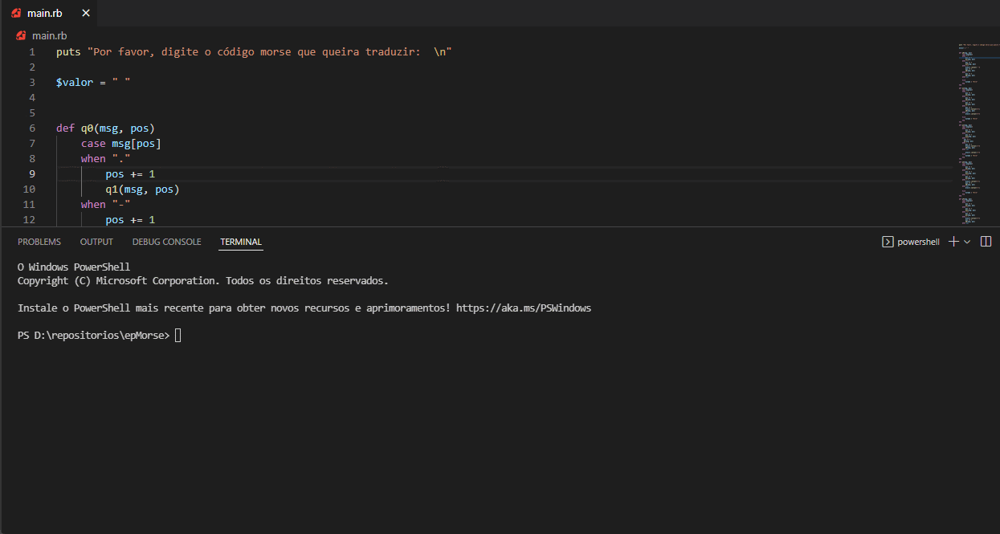

<h1 align="center"<strong>  EP1 - LFA  </strong></h1>

<h1 align="center"><strong>Descrição do projeto / Tecnologias Usadas</strong></h1>

<h1><strong> 👩‍💻 Transdutor: Tradutor de Código Morse 🧑‍💻 </strong></h1>

Nosso desafio foi fazer um tradutor de Código Morse para caracteres comuns. Para isso, criamos um  Autômato Finito Determinístico - Transdutor que faz o reconhecimento do Alfabeto = { ".", "-" e " " } . 
  
Usamos o Ruby como linguagem https://www.ruby-lang.org/pt/documentation/

<h2 align="center"><strong>Feito por:</strong></h2>
  Daniel Bortoleti Melo, Stella Rufino, Mayara Rosa

<h2 align="center"><strong>Links :</strong></h2>

Vídeo 🎥: colocar link do video

<h1><strong> Programa em execução:  😎 </strong></h1>

